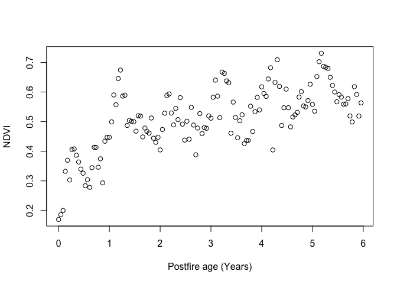
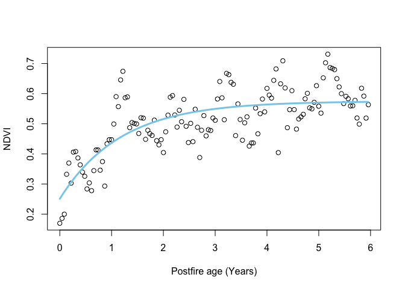
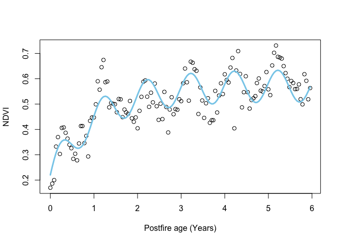
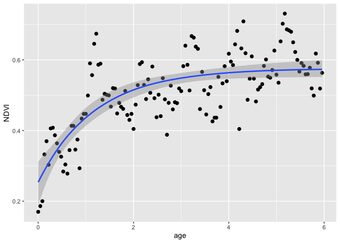
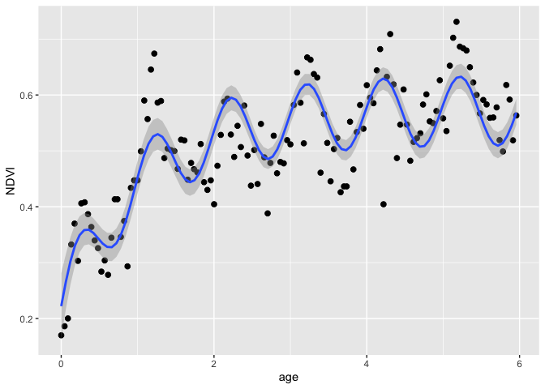
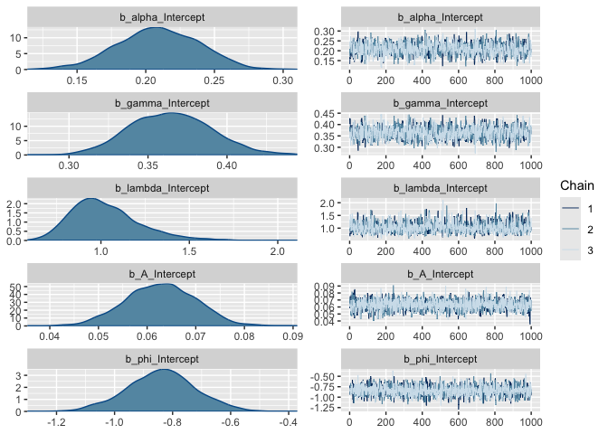
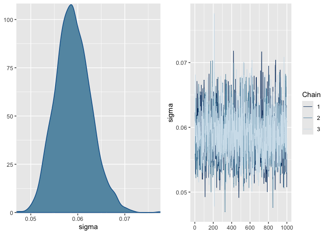

README
================
Jasper
2024-07-28

# Practical output: Master script

## Source functions, get data and plot

First we’ll *source()* (i.e. “run all code in”) the scripts with the
functions we made. Then we’ll set the URL, read in the data with
*download.NDVI()*, and plot it with *plot.NDVI()*.

``` r
## Load required functions by running source() on the individual function files
if(file.exists("functions/01_download.NDVI.R")) source("functions/01_download.NDVI.R")
if(file.exists("functions/02_plot.NDVI.R"))     source("functions/02_plot.NDVI.R")
if(file.exists("functions/03_negexp.R"))        source("functions/03_negexp.R")

## Download NDVI data
URL = "https://raw.githubusercontent.com/jslingsby/BIO3019S_Ecoforecasting/master/data/modisdata.csv"
dat <- download.NDVI(URL)

# Convert "calendar_date" to postfire age in days since fire - assuming the first date in the times series is the time of the fire 
dat$age <- (as.numeric(dat$calendar_date) - min(as.numeric(dat$calendar_date), na.rm = T))/365.25

## Plot overall NDVI time series
plot.NDVI(dat)
```

<!-- -->

<br>

Q1: This plot suggests that Fynbos greenness (NDVI) as observed from
satellite saturates with time since fire. Why do you think it saturates
rather than increasing linearly with time? (3 marks)

> *Answer 1:*

<br>

<br>

## Fit models using Non-linear Least Squares (NLS)

Now we’ll fit the simple and full negative exponential models using
Non-linear Least Squares (NLS).

First the simpler model:

``` r
## Simple model

# set parameters
par <- c(alpha = 0.2, gamma = 0.4, lambda = 0.5)

# fit model
fit_negexp <- nls(NDVI ~ alpha + gamma * (1 - exp(- age/lambda)),
                  data = dat, start = par, trace = F, 
                  control = nls.control(maxiter = 500))

# plot
plot.NDVI(dat = dat, fit = fit_negexp)
```

<!-- -->

<br>

And let’s look at the model summary with parameter estimates

``` r
# print model summary
summary(fit_negexp)
```

    ## 
    ## Formula: NDVI ~ alpha + gamma * (1 - exp(-age/lambda))
    ## 
    ## Parameters:
    ##        Estimate Std. Error t value Pr(>|t|)    
    ## alpha   0.25107    0.02887   8.695 1.04e-14 ***
    ## gamma   0.32371    0.02723  11.887  < 2e-16 ***
    ## lambda  1.17687    0.21396   5.500 1.84e-07 ***
    ## ---
    ## Signif. codes:  0 '***' 0.001 '**' 0.01 '*' 0.05 '.' 0.1 ' ' 1
    ## 
    ## Residual standard error: 0.07302 on 135 degrees of freedom
    ## 
    ## Number of iterations to convergence: 12 
    ## Achieved convergence tolerance: 3.912e-06

<br>

Now the full model:

``` r
## Full model

# set parameters
par <- c(alpha = 0.2, gamma = 0.4, lambda = 0.5, A = 0.6, phi = 0)

# fit model
fit_negexpS <- nls(NDVI ~ alpha + gamma * (1 - exp(- age/lambda))
                   + A*sin(2*pi*age + (phi + pi/6*(3 - 1))), 
                   data = dat, start = par, trace = F, 
                   control = nls.control(maxiter = 500))

# plot
plot.NDVI(dat = dat, fit = fit_negexpS)
```

<!-- -->

``` r
# print model summary
summary(fit_negexpS)
```

    ## 
    ## Formula: NDVI ~ alpha + gamma * (1 - exp(-age/lambda)) + A * sin(2 * pi * 
    ##     age + (phi + pi/6 * (3 - 1)))
    ## 
    ## Parameters:
    ##         Estimate Std. Error t value Pr(>|t|)    
    ## alpha   0.207522   0.024948   8.318 9.31e-14 ***
    ## gamma   0.364746   0.023926  15.245  < 2e-16 ***
    ## lambda  0.989154   0.126064   7.846 1.25e-12 ***
    ## A       0.063136   0.007114   8.875 4.12e-15 ***
    ## phi    -0.839167   0.111887  -7.500 8.10e-12 ***
    ## ---
    ## Signif. codes:  0 '***' 0.001 '**' 0.01 '*' 0.05 '.' 0.1 ' ' 1
    ## 
    ## Residual standard error: 0.05835 on 133 degrees of freedom
    ## 
    ## Number of iterations to convergence: 15 
    ## Achieved convergence tolerance: 6.941e-06

<br>

Lots more parameters…

Q2: How do the estimates for the common parameters compare? (3 marks)

> *Answer 2:*

<br>

<br>

## Compare NLS models using ANOVA

Modelers often want to know which of a set of models are better. One way
to do this when comparing nested\* models using least squares is using
analysis of variance (ANOVA). In this case the `anova()` function will
take the model objects as arguments, and return an ANOVA testing whether
the full model results in a significant reduction in the residual sum of
squares (and thus is better at capturing the data), returning an
F-statistic, Degrees of Freedom (the difference in the number of
parameters between the models) and p-value.

\*i.e. one model is a subset of the other, as in our case

``` r
anova(fit_negexp, fit_negexpS)
```

    ## Analysis of Variance Table
    ## 
    ## Model 1: NDVI ~ alpha + gamma * (1 - exp(-age/lambda))
    ## Model 2: NDVI ~ alpha + gamma * (1 - exp(-age/lambda)) + A * sin(2 * pi * age + (phi + pi/6 * (3 - 1)))
    ##   Res.Df Res.Sum Sq Df  Sum Sq F value   Pr(>F)    
    ## 1    135    0.71976                                
    ## 2    133    0.45280  2 0.26696  39.207 4.12e-14 ***
    ## ---
    ## Signif. codes:  0 '***' 0.001 '**' 0.01 '*' 0.05 '.' 0.1 ' ' 1

<br>

Q3: Which model is better? (1 mark)

> *Answer 3:*

<br>

<br>

Q4: How many degrees of freedom are there in this ANOVA and why
(i.e. what are they)? (3 marks)

> *Answer 4:*

<br>

<br>

## Fit models using Maximum Likelihood Estimation (MLE)

First let’s fit the simpler model:

``` r
## Fit the simpler model using MLE

# set parameters
par <- c(alpha = 0.2, gamma = 0.4, lambda = 0.5)

# fit model
fit_negexpMLE <- fit.negexp.MLE(dat, par)

# plot
plot.NDVI(dat)
# add curve with MLE parameters
lines(dat$age, pred.negexp(fit_negexpMLE$par,dat$age), col = 'skyblue', lwd = 3)
```

<!-- -->

``` r
fit_negexpMLE
```

    ## $par
    ##     alpha     gamma    lambda 
    ## 0.2510442 0.3237419 1.1767370 
    ## 
    ## $value
    ## [1] 359053.6
    ## 
    ## $counts
    ## function gradient 
    ##      118       NA 
    ## 
    ## $convergence
    ## [1] 0
    ## 
    ## $message
    ## NULL

<br>

Then the full model:

``` r
## Fit the full model using MLE

# set parameters
par <- c(alpha = 0.2, gamma = 0.4, lambda = 0.5, A = 0.6, phi = 0)

# fit model
fit_negexpMLES <- fit.negexpS.MLE(dat, par)

# plot
plot.NDVI(dat)
# add curve with MLE parameters
lines(dat$age, pred.negexpS(fit_negexpMLES$par,dat$age), col = 'skyblue', lwd = 3)
```

<!-- -->

``` r
fit_negexpMLES
```

    ## $par
    ##       alpha       gamma      lambda           A         phi 
    ##  0.20772317  0.36449293  0.98919689  0.06310554 -0.83741663 
    ## 
    ## $value
    ## [1] 225574.7
    ## 
    ## $counts
    ## function gradient 
    ##      914       NA 
    ## 
    ## $convergence
    ## [1] 0
    ## 
    ## $message
    ## NULL

<br>

## Compare MLE models using Akaike’s information criterion (AIC)

Note that we can’t compare our MLE models using ANOVA because our custom
functions do not return full model fits like the `nls()` function - only
the parameter estimates, negative log-likelihoods and a few other
diagnostics.

Another way to compare models (and probably the most common) is using
the Akaike information criterion (AIC), which is an estimator of
prediction error (i.e. relative quality) of statistical models for a
given set of data.

The formula for the Akaike information criterion is:

$AIC = 2K -2(ln(L))$

Where:

- $k$ = the number of estimated parameters in the model
- $L$ = maximum value of the likelihood function for the model

Since we have our negative log likelihoods (i.e. $-ln(L)$ in the formula
above), we can calculate the AICs and compare them.

``` r
AIC_simple = 6 + 2*fit_negexpMLE$value

AIC_simple
```

    ## [1] 718113.1

``` r
AIC_full = 6 + 2*fit_negexpMLES$value

AIC_full
```

    ## [1] 451155.3

<br>

When comparing models, the lower the AIC the better, and in general a
difference in AIC of 3 or more is analagous to the models being
significantly different.

``` r
AIC_simple - AIC_full
```

    ## [1] 266957.8

<br>

Q5: Is there a preferred model and if so, which one? (2 marks)

> *Answer 5:*

<br>

<br>

The nice thing about AIC is that the models you compare do not have to
be nested like they do for ANOVA, as long as the data are the same.
There are a few other constraints however…

Here are the AIC scores for our pair of NLS models:

``` r
AIC(fit_negexp, fit_negexpS)
```

    ##             df       AIC
    ## fit_negexp   4 -325.7135
    ## fit_negexpS  6 -385.6718

<br>

You’ll notice that these are completely different to the AICs for the
MLE models…

Q6: Why is it not okay to compare the AIC of these NLS models with the
AIC of the MLE models? Hint: type `?AIC` into the R console and do some
reading. (3 marks)

> *Answer 6:*

<br>

<br>

## Going Bayesian

Ok. Now we’re going to run the models in a Bayesian framework. This
doesn’t use any of our functions as many of the model outputs are a bit
different. Here we’ll use the
[brms](https://paul-buerkner.github.io/brms/) R package for “Bayesian
regression models using Stan” instead. Fitting Bayesian models is
usually a bit trickier tham LS or MLE, but brms makes is relatively
easy.

First the simpler model:

``` r
library(brms)
```

    ## Loading required package: Rcpp

    ## Loading 'brms' package (version 2.20.4). Useful instructions
    ## can be found by typing help('brms'). A more detailed introduction
    ## to the package is available through vignette('brms_overview').

    ## 
    ## Attaching package: 'brms'

    ## The following object is masked from 'package:stats':
    ## 
    ##     ar

``` r
fit_negexpB <- brm(
              formula = bf(NDVI ~ alpha + gamma * (1 - exp(-(age/lambda))),
                 alpha ~ 1, gamma ~ 1, lambda ~ 1,
                 nl = TRUE),
              data = dat,
              chains = 3,
              iter = 2000,
              cores = 3,
              family = gaussian(),
              prior = c(prior(normal(0.2,1), nlpar = "alpha", lb = 0, ub = 1) + 
                          prior(normal(0.4,1), nlpar = "gamma", lb = 0, ub = 1) + 
                          prior(normal(0.5,1), nlpar = "lambda", lb = 0)
                        ),
              control = list(adapt_delta = 0.9)
              )
```

    ## Compiling Stan program...

    ## Start sampling

``` r
summary(fit_negexpB)
```

    ##  Family: gaussian 
    ##   Links: mu = identity; sigma = identity 
    ## Formula: NDVI ~ alpha + gamma * (1 - exp(-(age/lambda))) 
    ##          alpha ~ 1
    ##          gamma ~ 1
    ##          lambda ~ 1
    ##    Data: dat (Number of observations: 138) 
    ##   Draws: 3 chains, each with iter = 2000; warmup = 1000; thin = 1;
    ##          total post-warmup draws = 3000
    ## 
    ## Population-Level Effects: 
    ##                  Estimate Est.Error l-95% CI u-95% CI Rhat Bulk_ESS Tail_ESS
    ## alpha_Intercept      0.25      0.03     0.19     0.31 1.00      884     1278
    ## gamma_Intercept      0.32      0.03     0.27     0.38 1.00      860     1222
    ## lambda_Intercept     1.24      0.29     0.79     1.92 1.00     1209     1325
    ## 
    ## Family Specific Parameters: 
    ##       Estimate Est.Error l-95% CI u-95% CI Rhat Bulk_ESS Tail_ESS
    ## sigma     0.07      0.00     0.07     0.08 1.00     1659     1640
    ## 
    ## Draws were sampled using sampling(NUTS). For each parameter, Bulk_ESS
    ## and Tail_ESS are effective sample size measures, and Rhat is the potential
    ## scale reduction factor on split chains (at convergence, Rhat = 1).

And let’s plot the fit:

``` r
plot(conditional_effects(fit_negexpB), points = TRUE)
```

<!-- -->

Lastly, and this is different for Bayes, we can look at the
distributions of the posterior estimates.

``` r
plot(fit_negexpB, ask = F)
```

<!-- -->

Note that most models are too complex or too highly dimensional to
calculate the posteriors analytically, so most Bayesian models rely on
methods to estimate them. The “chains” on the right represent a Markov
chain Monte Carlo (MCMC) estimation process, run over several iterations
(2000 in our case), that make up the density plots on the left. We ran 3
chains to improve our search of the parameter space and thus improve our
posterior estimates. Note that the early estimates provided by each
chain are typically poor and the estimator needs to warm up (or
“burn-in”), during which time the plot (or “trace”) of the chains may
not be flat as is the case here. You usually discard the burn-in. By
default, brms discards the first half of the iterations, and the burn-in
is not plotted here. If these traces were not flat, it would mean that
the model had not converged and we should not trust the estimates.
Sometimes you can solve this by running longer chains (more iterations)
and trimming a longer burn-in, but if the model is not well specified
this will not fix the problem and you’ll have to improve your model
specification, data, or both.

<br>

Q7: What do the posterior density plots represent? (2 marks)

> *Answer 7:*

<br>

<br>

Now let’s do the same for the full model.

``` r
fit_negexpBS <- brm(
  formula = bf(NDVI ~ alpha + gamma * (1 - exp(-(age/lambda))) + A*sin(2*3.141593*age + (phi + 3.141593/6*(3 - 1))),
               alpha ~ 1, gamma ~ 1, lambda ~ 1, A ~ 1, phi ~ 1,
               nl = TRUE),
  data = dat,
  chains = 3,
  iter = 2000,
  cores = 3,
  family = gaussian(),
  prior = c(prior(normal(0.2,1), nlpar = "alpha", lb = 0, ub = 1) + 
              prior(normal(0.4,1), nlpar = "gamma", lb = 0, ub = 1) + 
              prior(normal(0.5,1), nlpar = "lambda", lb = 0) +
              prior(normal(0.6,1), nlpar = "A", lb = 0, ub = 1) +
              prior(uniform(-3.141593,3.141593), nlpar = "phi", lb = -3.141593, ub = 3.141593)
  ),
  control = list(adapt_delta = 0.9)
)
```

    ## Compiling Stan program...

    ## Start sampling

``` r
summary(fit_negexpBS)
```

    ##  Family: gaussian 
    ##   Links: mu = identity; sigma = identity 
    ## Formula: NDVI ~ alpha + gamma * (1 - exp(-(age/lambda))) + A * sin(2 * 3.141593 * age + (phi + 3.141593/6 * (3 - 1))) 
    ##          alpha ~ 1
    ##          gamma ~ 1
    ##          lambda ~ 1
    ##          A ~ 1
    ##          phi ~ 1
    ##    Data: dat (Number of observations: 138) 
    ##   Draws: 3 chains, each with iter = 2000; warmup = 1000; thin = 1;
    ##          total post-warmup draws = 3000
    ## 
    ## Population-Level Effects: 
    ##                  Estimate Est.Error l-95% CI u-95% CI Rhat Bulk_ESS Tail_ESS
    ## alpha_Intercept      0.21      0.03     0.15     0.26 1.00     1068     1588
    ## gamma_Intercept      0.36      0.03     0.32     0.42 1.00     1210     1516
    ## lambda_Intercept     1.03      0.19     0.72     1.48 1.00     1339     1770
    ## A_Intercept          0.06      0.01     0.05     0.08 1.00     2504     1886
    ## phi_Intercept       -0.84      0.12    -1.08    -0.61 1.00     2659     2010
    ## 
    ## Family Specific Parameters: 
    ##       Estimate Est.Error l-95% CI u-95% CI Rhat Bulk_ESS Tail_ESS
    ## sigma     0.06      0.00     0.05     0.07 1.00     1911     1714
    ## 
    ## Draws were sampled using sampling(NUTS). For each parameter, Bulk_ESS
    ## and Tail_ESS are effective sample size measures, and Rhat is the potential
    ## scale reduction factor on split chains (at convergence, Rhat = 1).

And let’s plot the fit:

``` r
plot(conditional_effects(fit_negexpBS), points = TRUE)
```

<!-- -->

And look at the distributions of the posterior estimates.

``` r
plot(fit_negexpBS, ask = F)
```

<!-- --><!-- -->

<br>

Q8: Assuming the full Bayesian model is the best model, would any of the
parameter estimates of any of the models be significantly unlikely to be
true (if you were to apply the frequentist criterion of P \< 0.05), and
if so, which ones? (3 marks)

> *Answer 8:*

<br>

<br>
